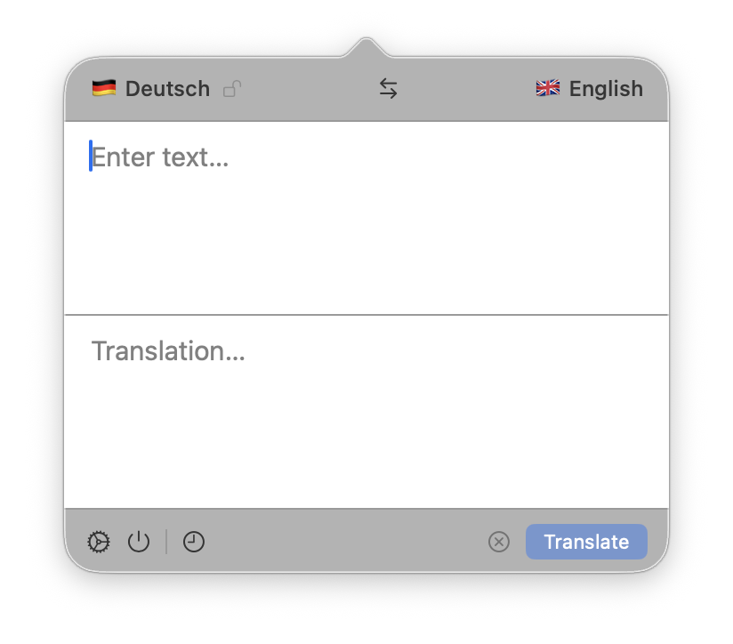
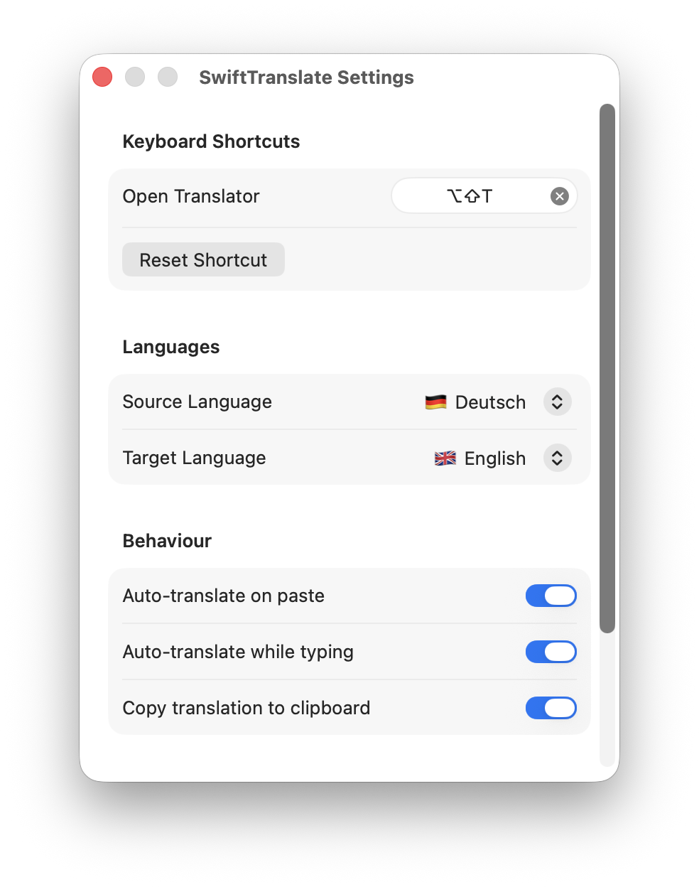

# SwiftTranslate

A macOS menu bar app for fast offline translation. Powered by Apple's on-device Translation framework. No account, no internet, no tracking.

<p align="center">
  
  &nbsp;&nbsp;
  
</p>

## Features

- **Offline** — All translation happens on-device via Apple's Translation framework.
- **Menu Bar** — Lives in the menu bar, out of your way until you need it.
- **Global Hotkey** — Open from anywhere with `⌥⇧T` (customizable).
- **Auto Language Detection** — Detects EN, DE, FR, ES and IT automatically.
- **Auto-Translate** — Translates on paste or while typing.
- **Auto-Copy** — Result is copied to the clipboard automatically.
- **History** — Keeps the last 10 translations, synced via iCloud.
- **Language Lock** — Pin the source language to skip auto-detection.

## Requirements

| | |
|---|---|
| macOS | 15.0 Sequoia or later |
| Architecture | Apple Silicon & Intel |
| Disk space | ~300–600 MB for language packs (downloaded once on first launch) |

## Installation

Download the latest release from the [Releases](../../releases) page, unzip it, and move **SwiftTranslate.app** to your Applications folder.

**Build from source**

```bash
git clone https://github.com/philippbev/SwiftTranslate.git
cd SwiftTranslate
swift build -c release
```

## First Launch

SwiftTranslate walks you through a short setup on first launch:

1. **Welcome** — Quick overview of what the app does.
2. **Language packs** — Downloads the EN↔DE translation models (~300–600 MB). Only needed once.
3. **Done** — Press `⌥⇧T` from anywhere to open the translator.

## Usage

| Action | How |
|---|---|
| Open translator | Menu bar icon or `⌥⇧T` |
| Translate | `⌘↵` or the Translate button |
| Swap languages | `⇄` button in the top bar |
| Lock source language | Lock icon next to the source language |
| History | Clock icon in the bottom bar |
| Settings | Gear icon in the bottom bar |

## Supported Languages

| Language | |
|---|---|
| English | 🇬🇧 |
| German | 🇩🇪 |
| French | 🇫🇷 |
| Spanish | 🇪🇸 |
| Italian | 🇮🇹 |

## Settings

Open via the gear icon or `⌘,`:

- **Keyboard Shortcut** — Customize or reset the global hotkey.
- **Source / Target Language** — Set the default language pair.
- **Auto-translate on paste** — Translates when you paste text.
- **Auto-translate while typing** — Translates after a short pause.
- **Copy to clipboard** — Copies every translation automatically.
- **Clear History** — Wipes all saved translations.

## Architecture

```
SwiftTranslate/
├── App/                    # Entry point, AppDelegate, AppState
├── Core/
│   ├── Models.swift
│   ├── Persistence/        # HistoryStore, OnboardingStore
│   └── Services/           # HotkeyManager, LanguageDetector
└── Features/
    ├── Translator/         # MenuBarView, MultilineTextField
    ├── History/            # HistoryView
    ├── Settings/           # SettingsView
    └── Onboarding/         # OnboardingView
```

State is managed by a single `AppState` class using Swift's `@Observable` macro. Translation runs through Apple's `TranslationSession`. History is persisted locally and synced via `NSUbiquitousKeyValueStore`.

## Dependencies

[KeyboardShortcuts](https://github.com/sindresorhus/KeyboardShortcuts) by Sindre Sorhus — global hotkey registration and the recorder UI in Settings.

## Privacy

SwiftTranslate does not collect or transmit any data. Everything stays on your device and in your personal iCloud account.

## License

MIT
