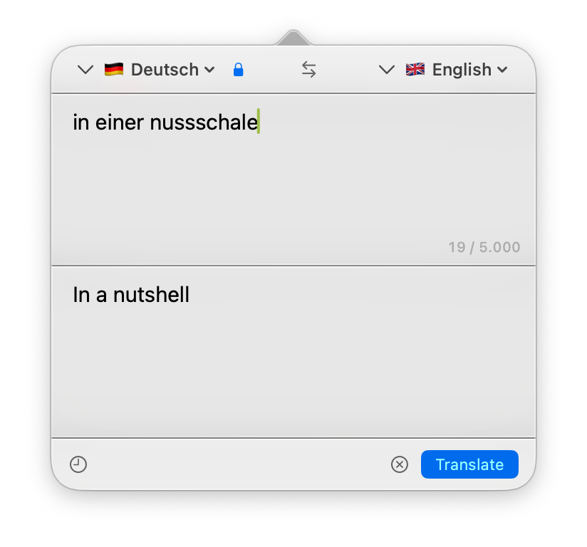
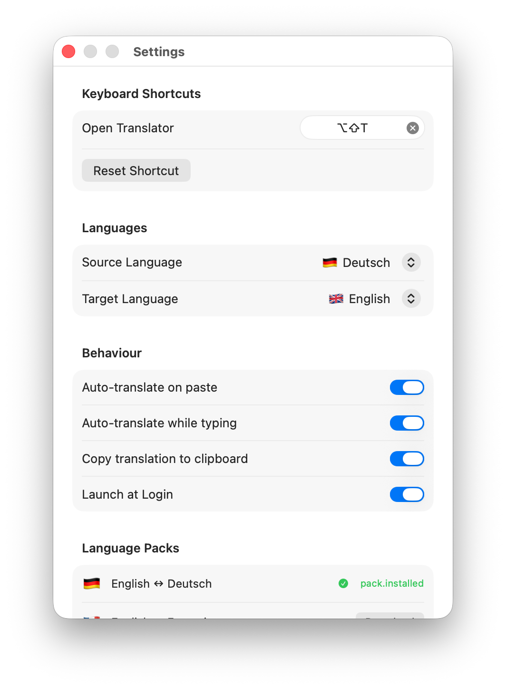

# SwiftTranslate


As a non-native English speaker, in your Corporate-live, you sometimes just need to quickly translate a word or phrase without opening a browser. SwiftTranslate lives in your menu bar, responds to a hotkey, and translates entirely on-device. No account, no internet, no AI.

---

## Features

- Translate between **9 languages**: English, German, French, Spanish, Italian, Portuguese, Dutch, Japanese, Chinese
- Fully offline — uses Apple's on-device Translation framework
- Language auto-detection while typing
- Auto-translate on paste and while typing (configurable)
- Auto-copies result to clipboard (optional)
- Global hotkey to open/close the app (`⌥⇧T` by default, customizable)
- Translation history (last 50 entries, searchable by tapping)
- Language pack manager in Settings — download only what you need
- Launch at Login support
- Right-click the menu bar icon for Settings and Quit
- Liquid Glass UI — designed for macOS 26

## Screenshots




## Requirements

- **macOS 26** (Tahoe) or later
- Apple Silicon or Intel Mac

## Installation

1. Download `SwiftTranslate.dmg` from the [latest release](https://github.com/philippbev/SwiftTranslate/releases/latest).
2. Open the DMG and drag **SwiftTranslate.app** to your Applications folder.
3. On first launch, right-click → **Open** to bypass Gatekeeper (the app is unsigned).
4. Download the language packs you need — one-time setup, ~150–300 MB per language pair.

## Usage

| Action | How |
|---|---|
| Open / close | Click menu bar icon or global hotkey (`⌥⇧T`) |
| Translate | `⌘↩` or click **Translate** |
| Clear | `✕` button next to Translate |
| Swap languages | `⇄` button in the language bar |
| Settings | Right-click menu bar icon → **Settings…** |
| Quit | Right-click menu bar icon → **Quit SwiftTranslate** |

## Build from Source

Requires **Xcode 16+** and **Swift 5.9+**.

```bash
git clone https://github.com/philippbev/SwiftTranslate.git
cd SwiftTranslate

# Debug build
swift build

# Release (universal binary)
swift build -c release --arch arm64 --arch x86_64

# Run tests
swift test
```

## Architecture

State management is centralized in `AppState` (`@Observable`), injected into views via the environment. Translation sessions use Apple's `TranslationSession` API with `.translationTask()` SwiftUI modifiers. Language detection uses the `NaturalLanguage` framework with debouncing.

```
SwiftTranslate/
├── App/                  # Entry point, AppState, localization
├── Core/
│   ├── Models.swift      # SupportedLanguage, HistoryEntry, LangPair
│   ├── Persistence/      # HistoryStore, OnboardingStore
│   └── Services/         # HotkeyManager, LanguageDetector, LaunchAtLoginManager
├── Features/
│   ├── Translator/       # MenuBarView, MultilineTextField
│   ├── Settings/         # SettingsView, LanguagePacksSection
│   ├── History/          # HistoryView
│   └── Onboarding/       # OnboardingView (welcome → download → ready)
└── Resources/            # Localizations (de, en), app icon
```

## License

MIT — see [LICENSE](LICENSE).
